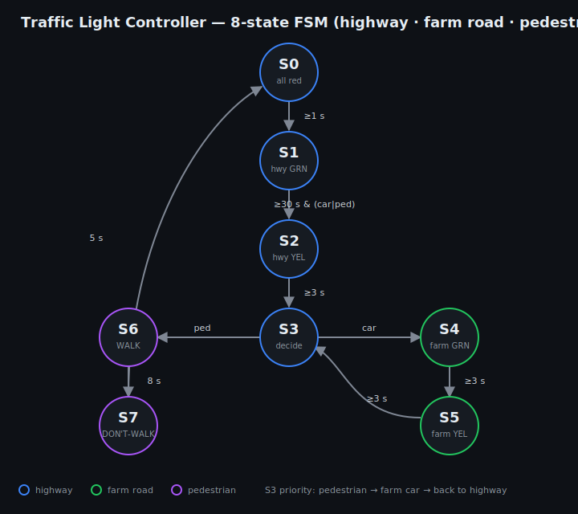

# Traffic Light Controller — Full System (Zybo Z7-10)

A complete, board-ready traffic-light controller for a **highway / farm-road
intersection**, built around a **6-state Moore FSM** in Verilog and running on the
Digilent **Zybo Z7-10** FPGA. The highway has priority and stays green by default;
when a driver presses the farm-road button, the controller counts down the
highway's minimum green, cycles through yellow and all-red, then gives the farm
road its green — and returns control to the highway. Real-time second-by-second
timing comes from the 125 MHz board clock.

**Live demo:** open [`tlc-demo.html`](tlc-demo.html) (host it for a shareable link).

## State diagram



## How a button press drives the lights

What actually happens when someone presses the farm-road button:

1. **Idle:** highway is **GREEN**, farm road is **RED** (`S1`). The seconds counter
   runs; the on-board LEDs show the countdown.
2. **Press:** the button is debounced and a **request is latched** (a quick tap is
   enough — you don't have to hold it).
3. **Minimum green:** the highway keeps its green until it has been green for at
   least **30 s**. The countdown LEDs show the time left.
4. **Hand-over:** once the minimum is met *and* a car is waiting, highway goes
   **YELLOW** (3 s, `S2`) -> both **RED** (1 s, `S3`) -> farm road **GREEN**
   (`S4`). The latched request is cleared here — "request served."
5. **Farm green:** stays green at least **3 s**, up to **18 s** if cars keep coming
   (button held); otherwise it ends as soon as the road is clear.
6. **Return:** farm **YELLOW** (3 s, `S5`) -> both **RED** (1 s, `S0`) -> highway
   **GREEN** again.

A press never instantly flips red to green — it *requests* the change, and the FSM
hands the intersection over safely after the highway's minimum green, exactly like
a real demand-actuated signal.

### Phases

| State | Highway | Farm | Duration |
|---|---|---|---|
| `S0` | Red | Red | 1 s (all-red safety gap) |
| `S1` | **Green** | Red | >= 30 s, until a car is waiting |
| `S2` | **Yellow** | Red | 3 s |
| `S3` | Red | Red | 1 s |
| `S4` | Red | **Green** | 3 s min / 18 s max, until road clears |
| `S5` | Red | **Yellow** | 3 s |

## System architecture

```
 125 MHz Clk -> tlc_prescaler -> tick (1 Hz, or ~15x for demo via sw[0])
                                  |
 btn[3] -> tlc_debounce -> reset  v
 btn[0] -> tlc_debounce -> request latch -> farmSensor
                                  |             |
                         seconds counter --> tlc_fsm (6-state Moore)
                                               |  state, signals
                                               v
                                          tlc_lights -> highwayLights{R,Y,G}
                                                        farmLights{R,Y,G}
                         countdown -> led[3:0]      RGB -> led6_g / led6_b
```

| File | Role |
|---|---|
| `rtl/tlc_top.v` | board top: wires the system to clock, buttons, switches, LEDs |
| `rtl/tlc_fsm.v` | the 6-state Moore FSM, timed in seconds |
| `rtl/tlc_prescaler.v` | 125 MHz -> 1-second tick (or ~15x faster for demos) |
| `rtl/tlc_debounce.v` | synchronize + debounce a push button, with edge detect |
| `rtl/tlc_lights.v` | decode each road's signal to discrete R/Y/G lamp outputs |
| `sim/tlc_top_tb.v` | self-checking full-system testbench |
| `xdc/tlc_top.xdc` | Zybo Z7-10 pin constraints |

## Board I/O

| Signal | Pin / device | Meaning |
|---|---|---|
| `Clk` | K17 | 125 MHz system clock |
| `btn[0]` | BTN0 | **farm-road car request** (press to ask for a green) |
| `btn[3]` | BTN3 | reset |
| `sw[0]` | SW0 | demo speed (1 = ~15x faster, so a full cycle is watchable) |
| `highwayLights[2:0]` | Pmod **JA1/JA2/JA3** | highway **Red / Yellow / Green** LEDs |
| `farmLights[2:0]` | Pmod **JA4/JA7/JA8** | farm **Red / Yellow / Green** LEDs |
| `led[3:0]` | LD0–LD3 | seconds remaining in the current phase (binary countdown) |
| `led6_g/led6_b` | RGB LD6 | phase indicator (green = highway, blue = farm) |

Wire six LEDs (with ~330 ohm resistors to ground) to the Pmod JA pins for the
physical traffic light. Even with **nothing** on the Pmod, the board still shows
the system working: the RGB LED indicates the active phase and the four LEDs count
down — so you can verify it before building the LED board.

## Simulate

```bash
iverilog -g2012 -o run sim/tlc_top_tb.v rtl/*.v
vvp run
```

The testbench uses a tiny prescaler so a full cycle runs in microseconds, presses
the farm-road button mid-cycle, and checks the discrete R/Y/G outputs at every
phase — ending with `TLC FULL SYSTEM: ALL TESTS PASSED`.

## Build on the FPGA (Vivado, Zybo Z7-10)

1. Add `rtl/*.v` as design sources and `sim/tlc_top_tb.v` as a simulation source.
2. Set the top module to **`tlc_top`**.
3. Add `xdc/tlc_top.xdc` as a constraint.
4. Run Synthesis -> Implementation -> **Generate Bitstream**, then program the board.

The design self-initializes (all registers have power-on values), so it starts in
the all-red state without needing a reset press. Timing uses the 125 MHz clock
directly via the prescaler — no MMCM/Clocking-Wizard IP required.

> Note: the Pmod **JA** pins in the XDC are the standard Zybo Z7-10 assignments; if
> your board revision differs and synthesis flags a pin, swap them for the JA pins
> in your board's master XDC.

## Live demo

[`tlc-demo.html`](tlc-demo.html) runs the same logic in the browser — press
**Farm car waiting**, watch the request get served after the highway's minimum
green, and use the speed control to see a full cycle quickly. Host it via GitHub
Pages (repo Settings -> Pages -> deploy from `main`) for a link.

## Board


