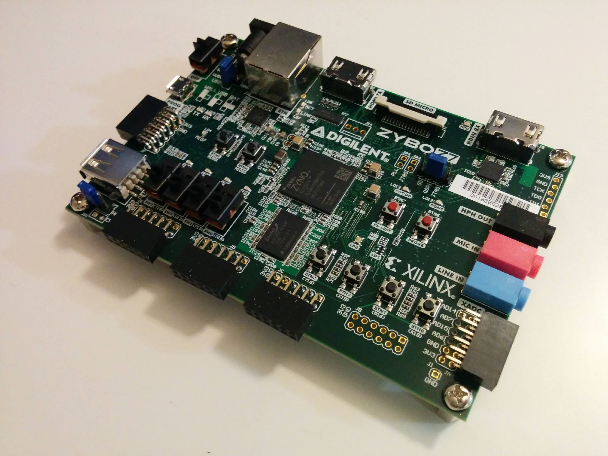
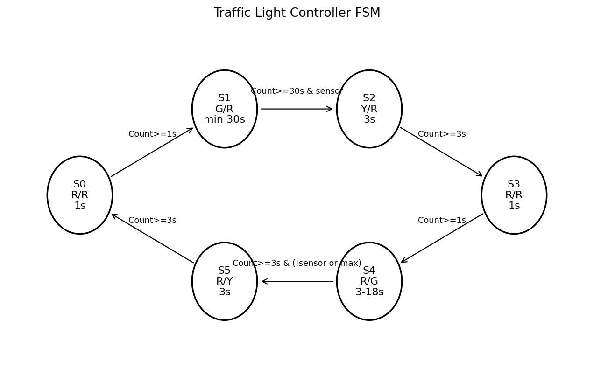
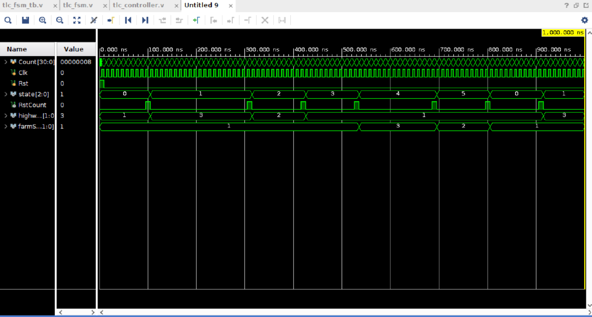

# Traffic Light Controller FSM on ZYBO Z7-10

This project implements a traffic light controller using a Finite State Machine (FSM) in Verilog. The design was built for the ZYBO Z7-10 FPGA board and controls a highway/farm-road intersection using timed state transitions and a farm-road sensor input.

## Project Overview

The controller manages two traffic signals:

- Highway traffic light
- Farm road traffic light

Each light uses a 2-bit output encoding:

| Signal | Meaning |
|---|---|
| `2'b11` | Green |
| `2'b10` | Yellow |
| `2'b01` | Red |

The design first implements a fixed-time traffic light controller, then improves it by adding a `farmSensor` input. The sensor allows the farm road light to turn green only when a vehicle is detected, while still giving priority to the highway.

## FPGA Board

The design targets the **ZYBO Z7-10** FPGA board.

## FSM State Diagram

## Simulation Waveform

## FSM States

| State | Highway Light | Farm Road Light | Description |
|---|---|---|---|
| `S0` | Red | Red | All-red safety delay |
| `S1` | Green | Red | Highway traffic moves |
| `S2` | Yellow | Red | Highway prepares to stop |
| `S3` | Red | Red | All-red safety delay |
| `S4` | Red | Green | Farm road traffic moves |
| `S5` | Red | Yellow | Farm road prepares to stop |

## Sensor Behavior

The `farmSensor` input is used to simulate a vehicle detector on the farm road.

- In `S1`, the highway remains green for at least 30 seconds.
- After the 30-second minimum, the controller only leaves highway green if `farmSensor` is active.
- In `S4`, the farm road remains green for at least 3 seconds.
- If the sensor remains active, the farm road green can extend up to a maximum time.
- This prevents the farm road from holding the intersection forever and gives priority back to the highway.

## Main Files

| File | Purpose |
|---|---|
| `tlc_fsm.v` | Main traffic light FSM |
| `tlc_controller_ver1.v` | Top-level FPGA controller |
| `synchronizer.v` | Synchronizes push-button inputs |
| `tlc_fsm_tb.v` | Testbench for simulation |
| `tlc_controller.xdc` | ZYBO Z7-10 constraint file |
| `README.md` | Project documentation |

## How It Works

The design uses a counter to create timing delays for each traffic light state. The FSM checks the counter value and sensor input to decide when to move to the next state. The `RstCount` signal resets the counter every time the FSM changes states.

The push-button inputs are asynchronous to the FPGA clock, so they pass through synchronizer modules before entering the FSM. This helps reduce metastability issues when using physical buttons.

## Tools Used

- Verilog HDL
- Vivado
- ZYBO Z7-10 FPGA board
- FSM design
- Digital logic design
- Testbench simulation
- Waveform debugging

## Skills Demonstrated

- FPGA design
- Finite State Machines
- Verilog HDL
- Counter-based timing
- Sensor-driven control logic
- Synchronization of asynchronous inputs
- Simulation and waveform analysis
- Hardware debugging on FPGA

## Author

Ali Hussein  
Computer Engineering — Texas A&M University
